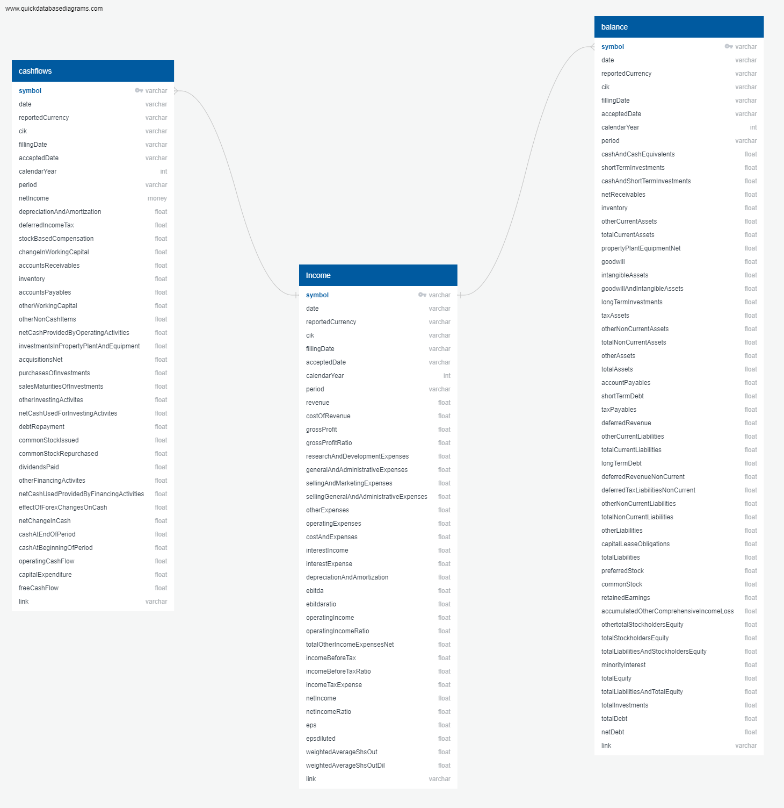
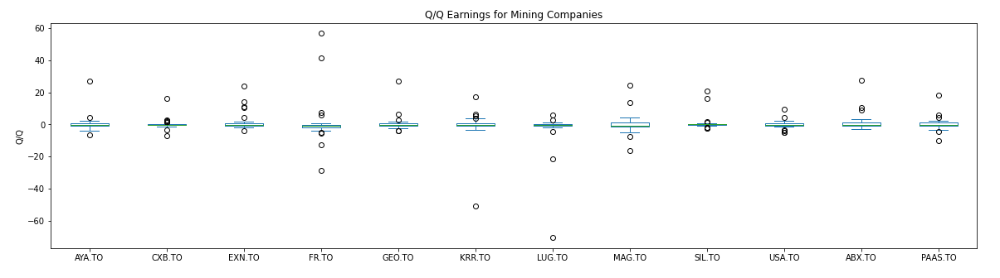
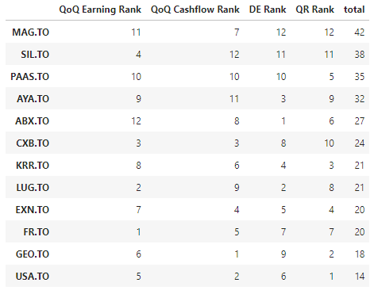

# Fundamental Quantitative Analysis of Explorer and Producer Mining Companies
## Motivation
The analysis notebooks included herein were developed to perform a quantitative fundamental analysis of several mining company stocks at a microeconomic level by attempting to assess the effectiveness of a mining company's management from financial statements.

The objective is to determine a stock's true value that an investor can compare against the current market price to see whether the security is undervalued or overvalued by other investors.
The series of analyses performed provide a clearer picture of the companies' financial health and growth perspective for market investment.

## Data Acquisition and Ratio Analysis
Historical balance sheets, and income and cash flow statements of 12 mining companies were retrieved via API from Financial Modeling Prep API – a separate jupyter notebook with defined functions is provided.

The historical prices of gold and silver were collected as well, along with iShares Core Canadian Universe Bond Index, for data comparison analyses.

The financial data were stored in a PostgresSQL database and subseqquently used to carry out a ratio analysis for each company in order to compare performance. Ratios evaluated included:

* Q/Q Earnings
* Y/Y Earnings for Q1-Q4
* Q/Q Cash flows
* D/E Ratio (solvency)
* Quick Ratio (A/D)
* The price-to-cash flow (P/CF) ratio 

The companies were ranked and scored based on the ratio analysis results.

## Data Cleanup & Exploration
The data were pulled from the API (Financial Modeling Prep API) via the defined python functions and stored in CSV format.

A financial statement database schema was developed on https://www.quickdatabasediagrams.com/ (see figure below), and the database was populated using the CSV files pulled from the API. Query Views were created to more succinctly pull the data required for analysis.

  

Upon loading the data into the notebook for analysis, it was noted that net income (earnings) tend to oscillate around zero for the companies assessed. This was noted in junior companies such as Aya, as well as in major well-established companies like Barrick (see figures below). This makes assessment of the typical market prospect ratio P/E difficult, as it would indicate the company  is consistently losing money. This behavior is due to the nature of the business, which requires extensive capital expenditures, both for exploration and the initial establishment of mining operations. However, once a mine is operational, its operating costs tend to be significantly lower and relatively stable. Additionally, because mining revenues are subject to fluctuations in commodity prices, it is important for mine operators to wisely manage changes in production levels. 

**For AYA Gold & Silver**

**For Barrick Gold**

## Data Analysis
The analysis performed looks at a company's performance in three distinct areas:

* Growth: Q/Q earnings, Y/Y Earnings for Q1-Q4, and Q/Q Cash flows
* Liquidity and Solvency: D/E Ratio, Quick Ratio
* Market Prospect: The price-to-cash flow (P/CF) ratio  

The **quick ratio** is an imprtant fundamental for evaluating mining companies because of the substantial capital expenditures and financing necessary for mining operations. Analysts and creditors prefer to see *quick ratio values higher than 1*, the minimum acceptable value.

The fundamental questions to be answered as therefore:

1. Which companies exhibit the best growth tendencies?
2. Which companies show acceptable levels of liquidity and solvency?
3. Which companies have overvalued/undervalued stocks?

The answers to these questions are presented in a ranking system developed for the analysis.

## Discussion of Results
### Growth: Q/Q Earnings

As shown in the boxplot above for the Q/Q earnings, companies such as FR, KRR, and LUG are quite volatile, with a wide spread into the negative Q/Q region. The results obtained were ranked using the 75th percentile Q/Q earnings for all 12 companies.

### Growth: Q/Q Earnings

As shown in the boxplot above for the Q/Q earnings, companies such as EXN, FR, and GEO exhibit larger negative Q/Q changes in cashflow outliers than any of the other companies. The results obtained were ranked using the 75th percentile Q/Q earnings for all 12 companies.

In addition to the Q/Q cashflow analysis, it was nterest to investigate if any correlation exists between the changes in commodity prices (gold, silver) and those in the cashflows of individual companies. A correlation with changes in bond ETF was also assessed. 

The heatmap above shows that there are generally poor correlations between companies quarterly changes  changes in quarterly cashflows with changes in commodity prices. The best correlations were found for AYA Gold & Silver with the price of silver (R=0.42) and CXB with the Bond ETF (R=0.42)

### Solvency: D/E

The D/E ratios were used to measure of the degree to which any one company is financing its operations with debt rather than its own resources. 

As shown below, AYA exhibits low D/E ratios begining in 2018 but had considerably higher values between 2013 and 2018. 

**For AYA Gold & Silver**

The more established major mining company Barrick also exhibits the same pattern (see below) but with ratios reaching a maximum of approximately 2.8. 

**For Barrick Gold**

The results obtained were ranked using the 75th percentile Q/Q earnings for all 12 companies.

### Solvency: D/E

The D/E ratios were used to measure of the degree to which any one company is financing its operations with debt rather than its own resources. 

As shown below, AYA exhibits low D/E ratios begining in 2018 but had considerably higher values between 2013 and 2018. 

**For AYA Gold & Silver**

The more established major mining company Barrick also exhibits the same pattern (see below) but with ratios reaching a maximum of approximately 2.8. 

**For Barrick Gold**

In contrast, EXN (Excellon Gold) appears to be a poor performer by exhibiting a negative D/E ratio (from having negative equity) -- see below.

**For Excellon Gold**

The results obtained were ranked using the 75th percentile D/E earnings for all 12 companies.

### Liquidity: Quick Ratio

The quick ratio measures the dollar amount of liquid assets available against the dollar amount of current liabilities of a company. Liquid assets are those current assets that can be quickly converted into cash with minimal impact on the price received in the open market, while current liabilities are a company's debts or obligations that are due to be paid to creditors within one year. As mention before, analysts and creditors prefer to see *quick ratio values higher than 1*, the minimum acceptable value

In the figure below, AYA is shown to consistently have quick ratios > 1 begining in 2018 but had considerably lower values (even negative - not shown in log scale) between 2013 and 2018. Note that this is the inverse of the observations made for the D/E ratio. 

**For AYA Gold & Silver**

In the figure below, AYA is shown to consistently have quick ratios > 1 begining in 2018 but had considerably lower values (even negative - not shown in log scale) between 2013 and 2018. Note that this is the inverse of the observations made for the D/E ratio. 

Although still greater than 1, the quick ratios for Barrick (see below) are much lower than those obtained for junior companies like AYA due to the larger amount of current liabilities.

**For Barrick Gold**

The results obtained were ranked using the 75th percentile Quick Ratio for all 12 companies.

### Market Prospect: P/CFS

The price-to-cash flow (P/CF) ratio is a multiple that compares a company's market value to its operating cash flow or its stock price per share to operating cash flow per share.
The P/CF multiple works well for companies that have large non-cash expenses such as depreciation. A low P/CF multiple may imply that a stock is undervalued in the market.
Some analysts prefer P/CF over price-to-earnings (P/E) since earnings can be more easily manipulated than cash flows.

(https://www.investopedia.com/terms/p/price-to-cash-flowratio.asp#:~:text=Key%20Takeaways-,The%20price%2Dto%2Dcash%20flow%20(P%2FCF),cash%20expenses%20such%20as%20depreciation.)

The 12 trailing month (TTM) cash flows per share were calculated for calculation of the ratio. 

In the figure below, AYA is shown to consistently have low P/CFS ratios, slowly ramping up in January 2022 -- it is undervalued.

**For AYA Gold & Silver**

In contrast the P/CFS ratios for Barrick (see below) are much closer to unity, indicating a balance between its stock and cashflow value.

**For Barrick Gold**

It was also of interest to observe if a correlation exists between the Cashflow per share and the stock price for each company. As shown in the heatmap below, a faily strong correlation exists for the AYA (R=0.85) and SIL (R=0.72).

Howevere, it was is noted that if a correlation between the change in CF/S and change in stock price is evaluated, the results are much poorer (see below). This comes as a result of the lag that is observed between the time a stick price change begins, and the subsequent change in cashflow.

## Conclusions
Based on the ranking system established, the two junior companies MAG silver and Aya Gold & Silver are considered as the top performers of the group, followed by PAAS, AYA, and Barrick.

It is noted that MAG and SIL have recently begun their production stage, and as such have growth potential, as seen in their income statements. Furthermore, their stocks are currently undervalued based on the PCFS assessment performed above.

